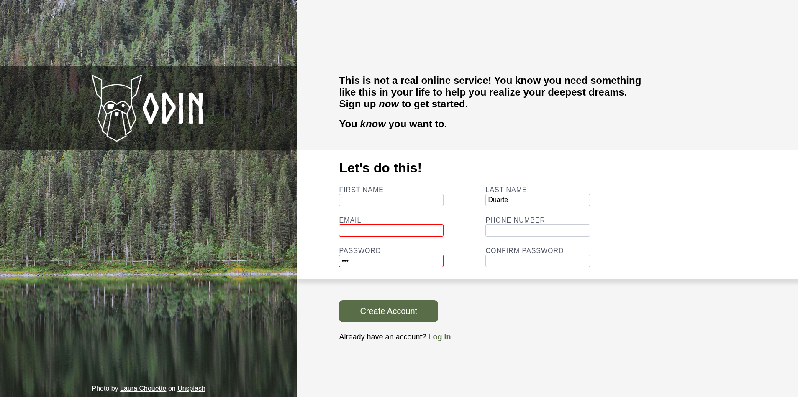

# Sign-Up Form

A modern sign-up form built as part of **The Odin Project** curriculum. The goal of this project was to practice HTML forms, CSS layout techniques, and form styling while recreating a provided design.

## Live Demo

🔗 https://migueld51244.github.io/Sign-up-Form/

---

## About the Project

This project focuses on building a responsive desktop sign-up page from a design mockup using semantic HTML and modern CSS techniques.

The emphasis was on creating a clean layout, organizing CSS effectively, and styling form elements using browser pseudo-classes.

Lesson Link: [Project: Sign-up Form](https://www.theodinproject.com/lessons/node-path-intermediate-html-and-css-sign-up-form)

Preview: 

---

## Features

- Semantic HTML5 structure
- Flexbox page layout
- Custom Norse font for the logo
- Full-height image sidebar
- Styled form with accessible labels
- Custom focus state with blue border and box shadow
- Invalid password styling using `:user-invalid`
- CSS custom properties (variables)
- Organized and maintainable stylesheet

---

## Technologies Used

- HTML5
- CSS3
- Flexbox
- CSS Variables
- CSS Pseudo-classes (`:focus`, `:user-invalid`)

---

## What I Learned

Working on this project helped me improve my understanding of:

- Structuring semantic forms
- Organizing large CSS files
- Using Flexbox for page layouts
- Creating reusable CSS classes
- Working with CSS custom properties
- Styling form validation states
- Building layouts from a design reference

One of the biggest lessons was learning that writing maintainable CSS is just as important as making a page look correct.

---

## Credits

### Design

- The Odin Project

### Background Image

Photo by Halie West on Unsplash.

### Logo

The Odin Project Logo

### Font

Norse Bold

---

## Future Improvements

- Make the layout fully responsive
- Add JavaScript password confirmation validation
- Improve accessibility with additional ARIA attributes where appropriate
- Add smooth input transition effects

---

## License

This project was created for educational purposes as part of **The Odin Project**.